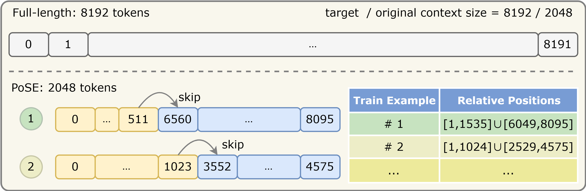
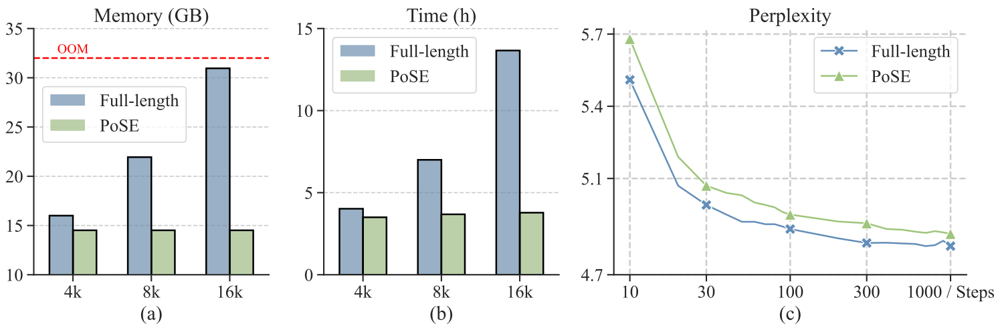
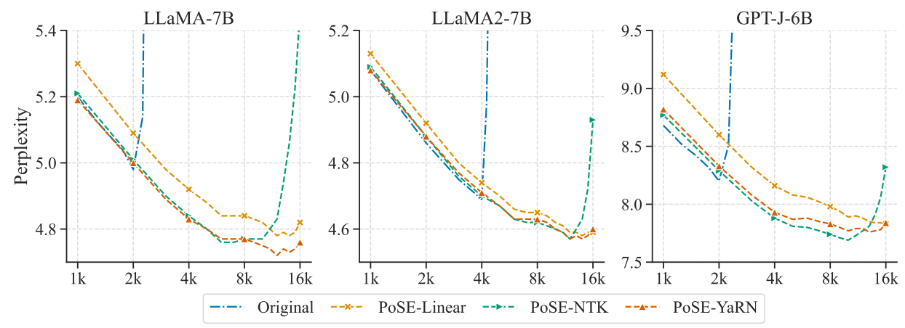
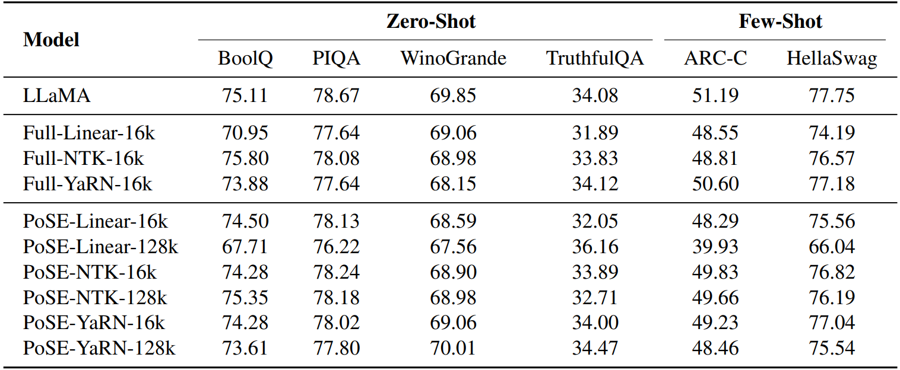

# PoSE

This repository contains the code for the paper "PoSE: Efficient Context Window Extension of LLMs via Positional Skip-wise Training"

In this work, we introduce **Po**sitional **S**kip-wis**E** (PoSE) training for efficient adaptation of large language models~(LLMs) to extremely long context windows. PoSE decouples train length from target context window size by simulating long inputs using  a fixed context window with manipulated position indices during training.




Take context window extension from 2,048 to 4,096 as an example, we partition the original context window of 2,048 tokens into two chunks, and adjust the position indices of the second chunk by adding a distinct skipping bias term. These bias terms, as well as the length of each chunk, are altered for each training example, so that the model can adapt to all relative positions of the target context window through fine-tuning.

Notably, by decoupling fine-tuning length from target context window, PoSE can theoretically extend the context window **infinitely**, constrained only by memory usage for inference. With ongoing advancements for efficient inference~(e.g., vLLM, Flash Attention), we believe PoSE holds great promise for scaling the context window even further.

## 🔥 What's New
* **[2023/10/10]** Updated our [paper](https://github.com/dwzhu-pku/PoSE/blob/master/paper/PoSE-v2.pdf) and code. Improved writing, added some discussion about chunk number and coverage possibility of relative positions in Appendix. Removed unused code and implemented a minor fix in `train_preprocess_function_pose` to make the coverage possiblity more uniform for large relative positions
* **[2023/09/22]** Inclued results of PoSE on Baichuan2. We further consolidated the effectiveness of our method.
* **[2023/09/19]** Our [paper](https://arxiv.org/abs/2309.10400) and code were released.

## 🔧 Reproduction
To replicate our results, follow these steps to download the code and necessary dependencies:
```
git clone https://github.com/dwzhu-pku/PoSE.git
cd PoSE
pip install -r requirements.txt
```
Additionally, as we utilize [lm-eval-harness](https://github.com/EleutherAI/lm-evaluation-harness) for evaluation on standard benchmarks, please install lm-eval-harness under the `helper/` folder.

### Data, Models and Computation Resources
We have conducted experiments with Llama-7B, Llama2-7B, and GPT-J-6B, Baichuan2-7B.

All the models are fine-tuned on The Pile dataset. Since this dataset is randomly shuffled, we use only the 00 split for training. We further filter short inputs and keep 10w samples for fine-tuning, which has proven sufficient for our method.

In terms of computation resources, all our training is conducted on 8 * 32G V100, and all evaluations are completed on a single A100.

### Training and Evaluation


The scripts under `script/` comprehensively cover the commands for training and evaluation.

For training, the key modifications revolve around position indices of the input text. You can refer to the `train_preprocess_function_pose` function to understand our proposed method. There are also minor revisions in `my_modeling_xxx.py` and `my-configuration_xxx.py` for implementing linear / NTK / YaRN interpolations and for utilizing xformers for efficient training & inference. Note that we use the revised version of YaRN in our experiments, as supported by the issue [inv_freq seems not calculated right](https://github.com/jquesnelle/yarn/issues/24). For example, You can start training Llama for context extension from 2k to 128k (64x) with YaRN interpolation by running comments as follows:

```bash
cd PoSE
bash script/run_train_skipos.sh 64 yarn
```

For evaluation, we made no revisions to position indices, so the process remains the same as the common setting. You can run following comments for the evaluation of passkey retrieval / ppl / standard benchmarks:

```bash
cd PoSE
bash script/run_eval_passkey.sh # for passkey retrieval
bash script/run_eval_ppl.sh # for ppl
bash script/run_lm_eval.sh # for standard benchmarks
```

## 📈 Experiment Results
Empirically, we demonstrate that PoSE achieves significant memory and time efficiency:



It is compatible across various RoPE-based models and interpolation strategies:



Capable of extending to 128k when combined with YaRN interpolation:


And it exhibits only minimal performance degradation on standard benchmarks:



## 🌟 Citation
If you find this repo helpful, please cite our paper as follows:

```bibtex
@misc{zhu2023pose,
      title={PoSE: Efficient Context Window Extension of LLMs via Positional Skip-wise Training}, 
      author={Dawei Zhu and Nan Yang and Liang Wang and Yifan Song and Wenhao Wu and Furu Wei and Sujian Li},
      year={2023},
      eprint={2309.10400},
      archivePrefix={arXiv},
      primaryClass={cs.CL}
}
```